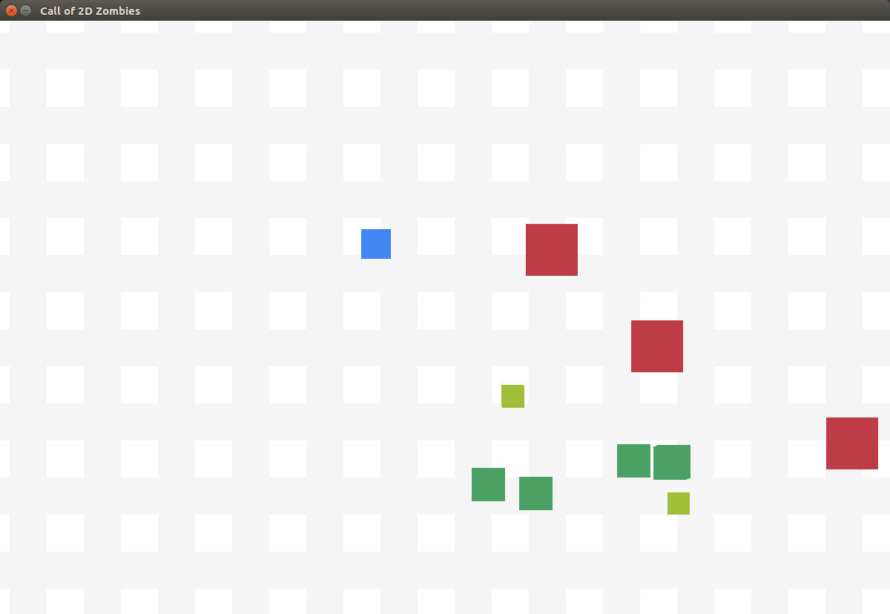

# Call of 2D Zombies
### A 2D Zombie Survival Game

Call of 2D Zombies is a two-dimensional zombie survival game written in C++ using SDL libraries. The player controls a small character using the arrow keys and tries to avoid enemies that chase it.

### TODO: Include screen shot

## Goal
The goal of this project was to refactor a simple two-dimensional game I had created in CSCI 24000. The purpose was to apply good software design principles, use design patterns where they were suitable, and eliminate as much code rot as possible.

## Design
#### TODO: include UML diagram

## Results

## Challanges

## Known Problems

## Additional Notes

## Other

### Useful Resources

#### [Game Programming Patterns](http://gameprogrammingpatterns.com/contents.html)

#### [SDL Tutorials](http://lazyfoo.net/tutorials/SDL/index.php)

### Built with

#### [SDL](https://www.libsdl.org/)

##### SDL Install

`apt-cache search libsdl2`

`sudo apt install libsdl2-dev`

##### SDL Image Install

`apt-cache search libsdl2-image`

`sudo apt install libsdl2-image-dev`

##### SDL Fonts Install

`apt-cache search libsdl2-ttf`

`sudo apt install libsdl2-ttf-dev`
