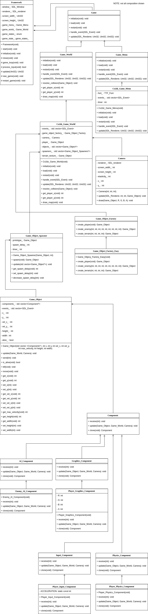

# Call of 2D Zombies
### A 2D Zombie Survival Game

Call of 2D Zombies is a two-dimensional zombie survival game written in C++ using SDL libraries. The player controls a small blue character using the arrow keys and tries to avoid enemies that chase it.

## Goal
The goal of this project was to refactor a simple two-dimensional game I created in my Intro to Computing class. The purpose was to apply good software design principles, use design patterns where they were suitable, and eliminate as much code rot as possible.

## Design

### Overview
Framework initializes SDL, contains the Game objects, window and renderer, and the main game loop. In each game loop it handles SDL events and updates the appropriate Game object depending on the current game state. Different Game objects and game states can be added for different components of a game (e.g. main menu, game world, game options, etc.). Its not a true framework but it does share an attribute of frameworks by calling on Game objects.   

Each Game object loads its media, handles SDL events given by the Framework, and progresses its state on each update. The update method implemented by each Game object uses the renderer it is given to draw anything to the screen.

The Game World, specifically, holds all of the Game Objects (note: Game World is a Game object, a Game object has Game Objects). When the Game World is updated it updates each of its Game Objects. Game Objects may call back on the Game World to handle collisions. The Game World maintains the creation and deletion of Game Objects using a Game Object Factory and Game Object Spawners.

Each Game Object is a container of Components. When a game object is updated, it updates each of its Components. The Components can handle Input, Physics, AI, and Graphics. The player, for example, is a container of Input, Physics, and Graphics Components. The Game Object container also implements message passing for communication between components.

Each Game Object is also a prototype. The Game World maintains a collections of spawners that it updates after updating all of its Game Objects. A spawner may add an enemy or any other Game Object to the container of Game Objects when it is updated. It also implements a timer to add enemies at adjustable intervals.

### Design patterns

#### MVC and the Game Loop
The core design patterns of this game, or of most games for that matter, are probably the Model View Controller and the Game Loop. Like most UI programs, this game utilizes the MVC pattern to collect input from the user, update the game model based on that input and render the view. Unlike other event driven UI applications and event driven games, this game also runs on a game loop. Game loops are useful when the game model needs to advance continuously - which is the case here.

##### The game loop timer
A simple implementation of a game loop might mark the start time of an "MVC cycle", run that cycle (i.e. process input, update model, render view), then sleep for however much time is left until the next cycle should start.

One problem with this implementation is that it doesn't account for the case in which processing input, updating, and rendering takes longer than the "tick rate" of the game.

Instead of sleeping for the remainder of the cycle, the game loop I have implemented updates and renders the appropriate amount of times on each game loop based on how lagged behind the current state and view of the game is. Lag, in this case, is the number of milliseconds the current game model and view is behind the current time. Lag is updated each game loop, and the game model is only updated and rendered every time the lag reaches the tick rate (i.e. milliseconds per update). After which, lag is updated (i.e. milliseconds per update is subtracted from lag). This implementation handles the case in which the game needs to play "catch up" by dynamically updating and rendering the appropriate amount of times based on how lagged behind it is.

#### Update method
In my initial design I would handle all input and events first, update the state of the game, and then render the view. The component pattern, which only has one update method for both updating the game state and rendering, led me to use a single update method for both updating the game state and rendering.

The biggest challenge of implementing an update method is figuring out the order in which Game Objects are updated. The double buffered approach updates each game object based on the previous state of the game world. Another approach is to update all game objects, handle all collisions between game objects, and then render. The implementation I use updates, handles collisions with, and renders each object sequentially. This implementation seems to work best, especially with the component pattern.

The order in which game objects are added and deleted is also very important. The implementation I use marks objects as dead when they are killed, skips over any dead objects while updating, and removes any dead objects at the end of updating all objects. Similarly, objects are only added after updating all objects.

#### Component
A game world is composed of game objects. Players, enemies, terrian, cameras for rendering views, etc.. My initial idea for structuring these objects was to create a base object class and have all concrete objects inherit from it. I started by creating a base object class with position, velocity, and health. Shortly after, I created a camera object and a static terrain object. I quickly realized that the camera didn't need health, and the static terrain object didn't need velocity. I could move health and velocity into a movable object class, but where would the camera fit into that? The camera needs to move too, but it doesn't make since to give the camera health.

The solution to this inheritance mess was the component pattern. Using the component pattern, I created a base Game_Object container. This game objects container stores a vector of components. These components can handle user input, physics, graphics, ai, etc. A game object can be constructed of whatever components it needs to operate how it should. When a game object is updated it simply updates each of its components. The game object is passed to each of the components so that each component can update any shared properties of the game object. Any properties that do not need to be shared are stored in the components themselves. Message broadcasting is also implemented for sharing data between components.

When a game object is updated, it is given the game world and a camera. It uses the game world to update its physics component and the camera for rendering with its graphics component.

##### The camera
My initial plan was to have the camera be a game object that follows another game object. This did not end up working well at all. The issue with implementing the camera as a game object itself is that it should only be updated once per cycle. Updating it to follow an object on each cycle works, but when the camera is passed to other game objects for those game objects to render to it, there is no way to render without updating again. One hack would be to add a render function to the game object but not all game objects need a render function. The component pattern works best when its only methods are those needed by all container objects, usually just an update method.

In the end I simply created a separate Camera class that has methods for both updating and rendering.

#### The Factory and the Prototype
The factory pattern is used to create game objects and the prototype pattern is used to spawn new objects throughout the game. During initialization, the game world creates spawners from game objects created by the factory.

I chose the factory over the builder because even though a game object can be thought of as being "built of components", there isn't much variation in the game objects. A player has components for input, physics, and graphics, an enemy has components for AI and rendering, and a terrain object has a component for graphics. A builder might be useful for constructing more complex game objects, but for the simple game this is the factory is simple and easy.

To implement the prototype pattern I added a clone method to each game object and each component. Cloning copies an object and all of its components. A spawner, rather than being used by some director, handles the logic of spawning game objects itself. The game world has a collection of spawners that it updates at the end of each game loop. If a spawners timer reaches zero it spawns its game object, adds the object to the vector of game objects in the game world, and resets its timer. Spawn delay can be adjusted during the course of the game to change the rate at which enemies spawn.

## Results
The final game runs smoothly and is a big improvement over its predecessor. It does not have all the features I would have liked to implement such as weapons, levels, menues, player profiles, statistics, and maps. However, my goal was never to build a feature packed game but rather to redesign its core components. Game development is more challenging than I would have imagined and I learned a lot from it. This project improved my skills in game development itself and in utilizing good software design patterns and principles.

## Challenges
Most of the challenges I faced were described in the Design section but to reiterate some of the big ones:

Designing and implementing the game loop and update method took the longest time overall. The update method was particularly difficult to implement. Using the component pattern, while very beneficial, forced me into combining the update and render steps into one. This delegated the logic of updating and rendering of objects into the objects themselves. Rather than updating all objects, then checking collisions, then rendering, each object updates, handles collisions, and renders individually. This implementation works well but it is different than the one I had originally planned on. Refactoring my program to fit it took some time.

Collision detection and collision physics were tricky to figure out as well. I originally planned on updating an object, then swapping velocities with any object it overlaps with. This issue with this implementation is that two objects that are moving away from each other after just colliding but are still overlapping will swap velocities again. They end up getting caught in a velocity swap loop and stick together. To fix this I implemented a 'move back' method in the Game Object. If a game object collides with another object, its velocity is updated and it is moved back one step. This way, objects never really overlap.

Time was also a challenge. MPC took longer to get familiar with and took up more time during development than I was expecting. As frustrating as it could be at times, I feel well acquainted with it now.

## Known Problems

#### Collision Physics
The game world is correctly detecting object collisions but when two objects collide they do not bounce off of each other like they should. They sort of just stick together. This has to do with a lack of precision in the map grid.

A player has an x and y position on the map as well as x and y velocities. At each game tick the player updates its velocities based on user input and then adds its x and y velocities to its x and y positions respectively. Since velocities and positions are stored as integers, the smallest amount of acceleration that can be added to or subtracted from each of the velocities is 1. And since the game runs at 50 frames per second its velocity only needs to be 24 (1200px / 50) for it to cross the entire screen (horizontally) in one second. For this example, it would only take half a second for an object to reach this speed, which is way too fast for smooth game play. To fix this, I have the players velocities capped at 8 and enemy velocity capped below that. In consequence, when a player moves in one direction, it only takes a fraction of a second to reach max velocity. Even worse, when a player bounces off another object it only takes a fraction of a second for the player to "take control" back over its velocity. The bounce that should be seen is practically unnoticeable.

One solution is to store velocities, acceleration, and positions as floats and round them when rendering. Another would be to create a virtual grid system with higher precision that the game model operates on and scale down when rendering.

#### Coupling between Game Objects and the Game World
Enemies need to follow the player and to do that they need to know the players position. Currently, they are using methods in the game world to get the player position. This tightly couples enemies with the game world. If more players needed to be added or enemies needed to follow a different game object, this coupling would need to be refactored.

#### Unused Capabilities
When designing the game, I planned to have more features than I had time to implement. Thus, there is underlying support for capabilities that are not fully implemented. These are:

1. Game models
Ideally, the Framework has a state and updates and renders the appropriate Game object based on its state. These states and Game objects could be menues, options, game world, etc.. The only one implemented is the game world.

2. Components that don't communicate
Some Game Object components might need to communicate with each other. Such as when physics happens before rendering and the physics component needs to tell the graphics component not to render the current object because it died. Message passing between components is implemented for cases like these but is not used.   

3. Dynamic rendering based on lag
When an object is updated it is given lag. Lag in this case is the amount of time the most recently updated and rendered game world is behind the current time. Knowing the lag can be useful when rendering. A graphics component could use this to try to predict where to render itself. This feature is never implemented.

4. Removing objects
I would have liked the player to have a weapon to shoot and kill enemies and for those enemies to be remove from the game world. To implement this, each object has an 'alive' boolean and a 'kill' method. However, since weapons are not implemented objects never die.

5. Event handling
The game world has a queue of events to handle at each update but does not use the events. Instead it only relies on the keyboard state.

6. Restarting
Restart methods are declared throughout but are not implemented. Instead, the user has to close the program and open it again to restart.

7. Explicitly rendering the map
Currently, the map background texture is hundreds of rectangles rendered over hundreds of pixels. I hacked this together to make it easier to see the players movement. Ideally, the only part of the map that should be rendered is the part visible on the players screen.

## Additional Notes

## Other

### Useful Resources

#### [Game Programming Patterns](http://gameprogrammingpatterns.com/contents.html)

#### [SDL Tutorials](http://lazyfoo.net/tutorials/SDL/index.php)

### Built with

#### [SDL](https://www.libsdl.org/)

##### SDL Install on Ubuntu

`apt-cache search libsdl2`

`sudo apt install libsdl2-dev`

##### SDL Image Install

`apt-cache search libsdl2-image`

`sudo apt install libsdl2-image-dev`

##### SDL Fonts Install

`apt-cache search libsdl2-ttf`

`sudo apt install libsdl2-ttf-dev`
